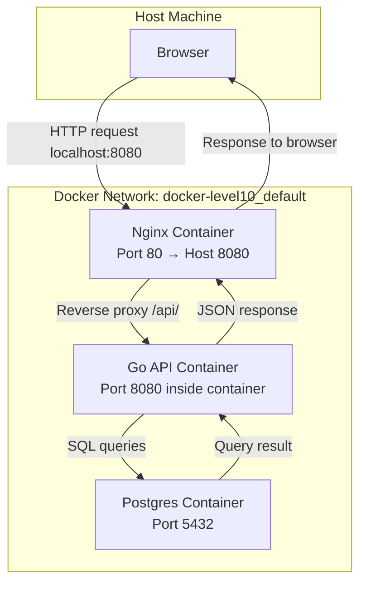

# Docker Level 10: Network Diagram

This diagram shows how the containers communicate in the Level 10 bonus setup.

## Notes

1. **Browser → Nginx**: All HTTP requests from your host on `localhost:8080` hit Nginx.
2. **Nginx → API**: Requests to `/api/` are proxied to the API container (`api:8080`).
3. **API → DB**: API queries Postgres using container name `db` as the hostname.
4. **Return flow**: Data flows back API → Nginx → Browser as JSON or HTML.
5. **Network**: All containers are on `docker-level10_default` network (created by docker-compose).

> Note: If you manually created `mynet` but didn’t attach containers, it remains empty in `docker network inspect mynet`.
